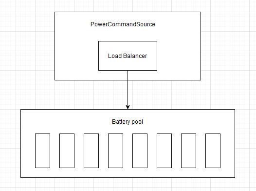
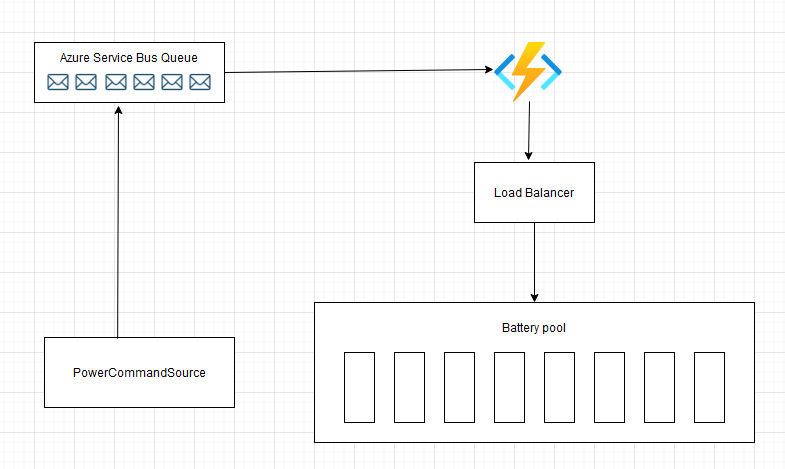

# VirtualPowerPlant
A virtual powerplant is an aggregation of several battery resources. These batteries need to be orchestrated to supply power to balance the grid from disturbances. The task here is to coordinate the batteries to output what the requested power wants.

## Projects
There are 5 projects - 
1. **Simulator**: This project simulates a power demand. The class PowerCommandSource is an abstraction of a sensor which tells us how much power the grid needs currently.
2. **Core**: Implements IVPPService (Virtual Power Plant Service). All the logics are written here (LoadBalancer for the battery pool).
3. **REST**: A dummy REST api project to communicate with the VPP.
4. **Function**: A de-coupled approach to load balance the battery pool. An event-driven approach.  
5. **Common**: Common dependency for the other projects.

The key ideas behind these projects are -
* Seperation of concerns.
* Implement a callback mechanism to load balance a bettery pool - **(way 1)**
* Implement a de-couple mechanism (event-driven approach) to load balance a battery pool - **(way 2)**

I used -
* Autofac framework for Dependency injection.
* AzureServiceBus for event queuing (way 2).

### How to run locally
#### Way 1:
Run the Simulator project. The CSV logger saves the data into a temp-file.

**Conceptual model**



#### Way 2: 
The following steps are needed - 
1. Comment out lines 48 to 54 in PowerCommandSource class so that we emit events to azure service bus.
``` 
/*
await _powerReaderEventService.EmitPowerReaderEvent(new PowerReader()
{
    BatteryPoolId = 1, // some dummy id to indicate which batterypool to balance
    Magnitude = Magnitude
});
*/
```

3. Fill in the connection string and the queue name from your AzureServiceBus inside the local.settings.json file in the **Function** app and the appsettings.json in the **Simulator** project.
``` 
"ServiceBusConnectionString": "",
"ServiceBusPowerReaderQueue": ""
``` 
4. Run the function app first, then the simulator.

**Conceptual model**



ENJOY! 
